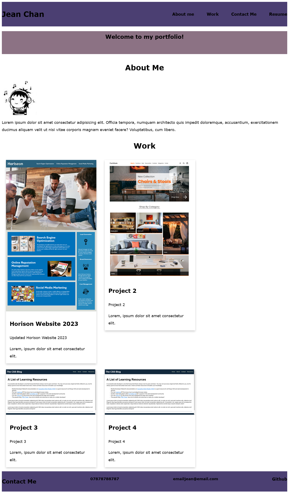

# <Jean C Portfolio>

## A website dedicated to the portfolio of Jean C

The motivation for this project was to create an interactive website to showcase my front-end web development skills.

This website provides links to my work, resume and GitHub account; it also follows accessibility standards, and is optimized for search engines.

## Installation

N/A

## Usage
The Jean C Portfolio contain four sections: About Me, Work and Contact Me. 

To navigate each section, select one of the four corresponding links at the top of the page.

1. The URL of the deployed application:
https://jeanj22.github.io/jeanc_portfolio/

2. The URL of the GitHub repository:
https://github.com/Jeanj22/jeanc_portfolio

 

## Credits

N/A

## License

N/A
